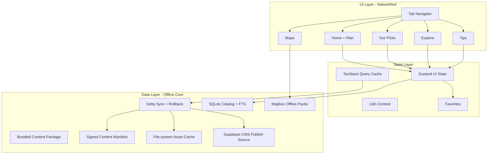

# Marrakech Compass Mobile App

## Design Philosophy

This app is designed as a **true offline-first travel companion** - like having Lonely Planet in your pocket. The architecture prioritizes:

1. **Instant usability**: Works fully offline from first launch (bundled content)
2. **Editorial quality**: Curated "best of" picks, not just a database dump
3. **Practical utility**: Quick tools, emergency info, and walking directions
4. **Beautiful UX**: Moroccan-inspired design with smooth animations

---

## Architecture Overview



---

## Tech Stack

- **Framework**: Expo SDK 54 (Managed Workflow)
- **Navigation**: Expo Router v6 (file-based routing)
- **Styling**: NativeWind v4 (Tailwind CSS for React Native) + theme tokens from marrakech-compass
- **State Management**: Zustand (UI/user state) + TanStack Query (sync/network cache)
- **Maps**: @rnmapbox/maps with offline tile support
- **i18n**: i18next + react-i18next + expo-localization (EN/FR/ES/DE/IT/NL/AR with RTL)
- **Content**: Hybrid - bundled JSON (offline-first) + optional Supabase sync
- **Storage**: AsyncStorage (settings only) + expo-sqlite (catalog/search) + expo-file-system (assets/packs)
- **Data Validation**: Zod schemas for all inbound content (bundled and synced)

---

## Project Structure

```
marrakechCompass3/
├── app/                          # Expo Router screens
│   ├── _layout.tsx               # Root layout with providers
│   ├── (tabs)/                   # Main tab navigation
│   │   ├── _layout.tsx           # Tab bar configuration
│   │   ├── index.tsx             # Home + Plan Your Trip
│   │   ├── picks.tsx             # Our Picks / Coup de Coeur
│   │   ├── explore.tsx           # Explore categories
│   │   ├── maps.tsx              # Offline maps
│   │   └── tips.tsx              # Travel tips
│   ├── place/[id].tsx            # Place detail screen
│   ├── itinerary/[id].tsx        # Itinerary detail screen
│   ├── category/[slug].tsx       # Category listing screen
│   └── settings.tsx              # Language & preferences
├── src/
│   ├── components/               # Reusable UI components
│   │   ├── ui/                   # Base: Button, Card, Badge, Accordion
│   │   ├── cards/                # PlaceCard, ItineraryCard, PickCard
│   │   ├── maps/                 # MapView, Marker, OfflineIndicator
│   │   └── layout/               # Header, TabBar, SafeArea
│   ├── content/                  # Bundled JSON content (offline-first)
│   │   ├── places.json           # All places data
│   │   ├── itineraries.json      # Trip itineraries
│   │   ├── picks.json            # Curated picks
│   │   └── tips.json             # Toolkit sections
│   ├── hooks/                    # Custom hooks
│   │   ├── useLocale.ts          # Localized content helper
│   │   ├── useFavorites.ts       # Favorites management
│   │   └── useOfflineStatus.ts   # Network/offline detection
│   ├── data/                     # Local persistence + repositories
│   │   ├── schema.ts             # SQLite schema and migrations
│   │   └── repository.ts         # Typed data access
│   ├── sync/                     # Remote update pipeline
│   │   ├── manifest.ts           # Version/checksum handling
│   │   ├── downloader.ts         # Delta package download
│   │   └── rollback.ts           # Last-known-good recovery
│   ├── search/                   # Offline search/indexing
│   │   └── fts.ts                # SQLite FTS queries
│   ├── monitoring/               # Telemetry + crash integration
│   │   ├── crash.ts
│   │   └── events.ts
│   ├── stores/                   # Zustand stores
│   │   ├── useAppStore.ts        # Main app state
│   │   └── useSettingsStore.ts   # User preferences
│   ├── services/                 # API & utilities
│   │   ├── content.ts            # Content loading (local + remote)
│   │   ├── maps.ts               # Mapbox utilities
│   │   └── supabase.ts           # Optional Supabase client
│   ├── themes/                   # Design system (from marrakech-compass)
│   │   └── index.ts              # Color tokens, typography, spacing
│   ├── i18n/                     # Internationalization
│   │   ├── index.ts              # i18n configuration
│   │   └── locales/              # Translation files
│   │       ├── en.json
│   │       ├── fr.json
│   │       ├── es.json
│   │       ├── de.json
│   │       ├── it.json
│   │       ├── nl.json
│   │       └── ar.json           # Arabic (RTL)
│   └── types/                    # TypeScript types
│       └── index.ts              # Place, Itinerary, Pick, Tip interfaces
├── assets/                       # Images, fonts, icons
│   ├── images/                   # Place photos, hero images
│   └── fonts/                    # Playfair Display, DM Sans
└── tailwind.config.js            # NativeWind configuration
```

---

## Content Data Models

Type-safe interfaces for all content:

```typescript
// Localized string type for multi-language support
type LocalizedString = Record<"en" | "fr" | "es" | "de" | "it" | "nl" | "ar", string>;

interface Place {
  id: string;
  slug: string;
  name: LocalizedString;
  description: LocalizedString;
  category: PlaceCategory;
  coordinates: { lat: number; lng: number };
  address: string;
  neighborhood: string;
  priceRange?: 1 | 2 | 3 | 4;
  rating?: number;
  images: string[];
  tips?: LocalizedString[];
  openingHours?: string;
  phone?: string;
  website?: string;
  featured?: boolean;
  status?: "open" | "temporarily-closed" | "seasonal";
  lastVerifiedAt?: string; // ISO date
  accessibilityTags?: ("wheelchair" | "step-free" | "family-friendly")[];
}

type PlaceCategory =
  | "restaurant"
  | "cafe"
  | "museum"
  | "gallery"
  | "riad"
  | "hotel"
  | "garden"
  | "courtyard"
  | "shopping"
  | "souk"
  | "hammam"
  | "spa"
  | "monument";

interface Itinerary {
  id: string;
  durationType: "1day" | "weekend" | "long-weekend" | "1week";
  title: LocalizedString;
  description: LocalizedString;
  days: ItineraryDay[];
}

interface ItineraryDay {
  dayNumber: number;
  title: LocalizedString;
  stops: ItineraryStop[];
}

interface ItineraryStop {
  placeId: string;
  timeSlot: string; // "9:00 AM - 11:00 AM"
  notes: LocalizedString;
}

interface Pick {
  id: string;
  category: PickCategory;
  placeId: string;
  title: LocalizedString;
  tagline: LocalizedString;
  whyWeLoveIt: LocalizedString;
  images: string[];
}

type PickCategory =
  | "architecture"
  | "djemaa-el-fna"
  | "shopping"
  | "cuisine"
  | "stay"
  | "hidden-gem"
  | "rooftop-view"
  | "art-design"
  | "cultural"
  | "museum"
  | "new-town"
  | "hammam";

interface TipSection {
  id: string;
  icon: string;
  title: LocalizedString;
  content: LocalizedString[];
  lastReviewedAt: string; // ISO date
  sourceRefs?: string[];
  safetyLevel?: "general" | "important" | "critical";
}

interface ContentManifest {
  version: string;
  publishedAt: string; // ISO date
  minAppVersion: string;
  checksum: string;
  deltaFrom?: string[];
}
```

---

## Feature Implementation

### Tab 1: Home + Plan Your Trip

**Hero Section:**

- Live weather widget (Open-Meteo API) with temperature, conditions, humidity
- Language switcher button in header
- Beautiful hero image with gradient overlay

**Plan Your Trip Section:**

- Duration selector chips: 1 Day, Weekend, Long Weekend, 1 Week
- Interactive itinerary cards with expand/collapse animation
- Day-by-day breakdown with timing and place links
- Bookmark/favorite itineraries

**Arrival Mode (Quick Tools):**

- Airport info and transfer options
- First steps checklist
- Emergency contacts quick access
- Currency converter widget
- Prayer times (for context)

**Quick Links:**

- Grid of icons linking to other tabs and key categories

**Don't Miss Carousel:**

- Horizontal scroll of featured highlights with images

---

### Tab 2: Our Picks (Coup de Coeur)

Editorial-style curated recommendations:

- **Best Architectural Experience** - Bahia Palace, Medersa Ben Youssef
- **Best Djemaa El Fna Experience** - timing, stalls, atmosphere tips
- **Best Shopping / Souks** - navigation, what to buy, where
- **Best Dining Experience** - from street food to fine dining
- **Best Place to Stay** - riads with character
- **Best Hidden Gem** - off-the-beaten-path discoveries
- **Best Rooftop View** - sunset spots, cafe terraces
- **Best Art & Design** - galleries, concept stores, artisan workshops
- **Best Cultural Experiences** - cooking classes, calligraphy, music
- **Best Museum Experiences** - Yves Saint Laurent, Dar Si Said, Photography Museum
- **Best Experience in New Town (Gueliz)** - modern cafes, boutiques, nightlife
- **Best Hammam Experience** - traditional vs luxury, what to expect

Each pick features:

- Rich hero imagery
- "Why We Love It" editorial description
- Practical tips
- Tap to view full place detail with map

---

### Tab 3: Explore

**Category Grid:**

- Restaurants & Cafes
- Museums & Galleries
- Riads & Hotels
- Gardens & Courtyards
- Shopping & Souks
- Hammams & Spas
- Day Trips (Atlas Mountains, Essaouira, Ouzoud)

**Features:**

- Offline full-text search (SQLite FTS) with transliteration + typo tolerance
- Filter by: neighborhood, price range, rating, open-now, distance, accessibility, family-friendly
- Sort by: editorial score, distance, and "open soon"
- Place cards with image, name, category, rating, price
- Heart icon to save to favorites
- Tap to view detail screen

**Saved/Favorites:**

- Accessible via header icon
- Persisted offline via Zustand + AsyncStorage

---

### Tab 4: Maps

**Full-screen Mapbox Map:**

- Interactive map centered on Marrakech Medina
- Offline map packs by zone and zoom (Medina Core, City Center, Full City) with size estimates
- Download progress indicator and status

**POI Markers:**

- Color-coded by category (using theme colors)
- Clustered at low zoom levels
- Tap marker to show place preview card

**Features:**

- Current location indicator (with permission)
- Search places on map
- Online turn-by-turn walking directions when connected
- Offline fallback navigation: cached route previews + bearing/waypoint guidance
- Recenter button
- Layer toggle (streets vs satellite)

**Offline Download Manager:**

- Granular pack manager with pause/resume/retry and low-storage protection
- Download status: Not downloaded / Downloading / Ready
- Size indicator before download

---

### Tab 5: Tips

Expandable accordion sections with essential travel info:

1. **Getting Around** - Petit taxis, buses, walking in Medina, calèche rides
2. **Language** - Key phrases in Darija/Arabic and French, pronunciation tips
3. **Etiquette & Customs** - Dress code, photography, mosque visits, Ramadan
4. **Climate & Packing** - Best seasons, what to wear, sun protection
5. **Bargaining Guide** - How to negotiate in souks, fair prices
6. **SIM Cards & WiFi** - Where to buy, data packages, cafe WiFi
7. **Food, Drink & Nightlife** - Must-try dishes, water safety, alcohol, bars and clubs
8. **Accommodation** - Riads vs hotels, booking tips, neighborhoods guide
9. **Health & Safe Travels** - Vaccinations, pharmacies, scam awareness, emergency contacts
10. **Money & Tipping** - ATMs, exchange rates, tipping customs
11. **Family Travel** - Kid-friendly activities, stroller tips, family riads
12. **LGBTIQ+ Travellers** - Legal context, safety advice, welcoming spaces
13. **Accessible Travel** - Mobility considerations, accessible riads, tour options
14. **Responsible Travel** - Sustainable tourism, ethical shopping, water conservation
15. **Nuts & Bolts** - Visas, electricity, time zone, public holidays, opening hours
16. **Scams & Incident Response** - Lost passport, theft steps, police/consulate workflow

Quick reference cards for most important info with `lastReviewedAt` stamp.
Persistent "Emergency Mode" action available from all tabs.

---

### Settings Screen

- **Language Selection**: EN / FR / ES / DE / IT / NL / AR (with flag icons, RTL support for Arabic)
- **Offline Maps**: Download status, manage storage
- **Safety Center**: Emergency contacts, embassy list, SOS message templates
- **Data Usage Mode**: Wi-Fi-only downloads, image quality, map storage cap
- **Clear Cache**: Reset local data
- **About**: App version, credits, feedback link

---

## Design System (from marrakech-compass)

### Colors (Moroccan-inspired)

```javascript
colors: {
  primary: '#C65D3B',      // Terracotta
  secondary: '#356B66',    // Teal
  accent: '#D9A441',       // Gold
  background: '#F7F4F0',   // Warm sand
  foreground: '#2D2622',   // Dark brown
  card: '#EFE9E2',         // Light sand
  muted: '#E5DFD6',
  mutedForeground: '#7A7471',
  border: '#DDD6CC',
  // Custom tokens
  terracotta: '#C65D3B',
  terracottaLight: '#D98B70',
  teal: '#356B66',
  tealLight: '#4D8A84',
  sand: '#D4C4A8',
  gold: '#D9A441',
  ochre: '#B07832',
}
```

### Typography

- **Display**: Playfair Display (headings, hero text)
- **Body**: DM Sans (content, UI text)
- Sizes: xs (10) to 4xl (30)

### NativeWind Integration

Extend Tailwind config with theme tokens:

```javascript
// tailwind.config.js
module.exports = {
  theme: {
    extend: {
      colors: {
        terracotta: { DEFAULT: "#C65D3B", light: "#D98B70" },
        teal: { DEFAULT: "#356B66", light: "#4D8A84" },
        sand: { DEFAULT: "#D4C4A8", light: "#EBE4D6" },
        gold: "#D9A441",
        ochre: "#B07832",
      },
      fontFamily: {
        display: ["PlayfairDisplay"],
        body: ["DMSans"],
      },
    },
  },
};
```

---

## Key Dependencies

```json
{
  "expo": "~54.0.0",
  "expo-router": "~6.0.0",
  "@rnmapbox/maps": "^10.0.0",
  "nativewind": "^4.0.0",
  "tailwindcss": "^3.4.0",
  "zustand": "^4.5.0",
  "@tanstack/react-query": "^5.0.0",
  "zod": "^3.23.0",
  "expo-sqlite": "~15.0.0",
  "i18next": "^23.0.0",
  "react-i18next": "^14.0.0",
  "expo-localization": "~16.0.0",
  "@react-native-async-storage/async-storage": "^2.0.0",
  "@expo/vector-icons": "^15.0.0",
  "expo-font": "~14.0.0",
  "expo-linear-gradient": "~15.0.0",
  "@supabase/supabase-js": "^2.0.0"
}
```

---

## Offline Strategy

### Content (Bundled JSON - Offline First)

1. Ship a signed baseline content package with the app.
2. On connectivity, fetch a lightweight manifest (`version`, `checksum`, `deltaFrom`).
3. Validate downloaded packages against checksum + schema before activation.
4. Apply delta updates into SQLite/file cache atomically.
5. Keep current + previous content versions for instant rollback.
6. Fall back to last-known-good package on any validation or migration failure.

### Maps (Mapbox Offline Tiles)

1. On first launch, recommend at least one map pack (Medina Core) with explicit size.
2. Offer optional larger packs (City Center, Full City) with Wi-Fi-only default.
3. Tiles cached via Mapbox SDK offline manager
4. Show download progress and completion status
5. Maps work fully offline once downloaded

### Favorites & Settings

- Persisted immediately via Zustand + AsyncStorage
- No network required
- Sync retries use exponential backoff and never block read paths.

---

## Reliability & Performance Budgets

- Cold start P75: <2.0s on mid-range Android, <1.5s on recent iPhone
- Scroll performance: 55+ FPS in list/map interactions
- Crash-free sessions: >=99.5%
- Max map/content download failure rate: <3%

## Observability & Analytics

- Crash reporting with offline queue and upload-on-connect
- Structured event taxonomy for key journeys (search, save, map download, emergency mode)
- Privacy-first analytics: no precise location persisted without explicit consent

## Testing & Release Gates

- Unit tests: stores, data validation, sync conflict handling
- Integration tests: offline bootstrap, manifest apply, rollback
- E2E tests (iOS/Android): core tab flows in offline and flaky-network modes
- Release gate: cannot ship if offline smoke suite fails

---

## Implementation Order

1. **Phase A - Foundation**: Expo setup, navigation shell, CI, lint/test baseline
2. **Phase B - Offline Data Core**: schema, manifest pipeline, validation, rollback, seed content
3. **Phase C - Core UX**: Home/Explore/Tips + detail screens wired to local repository
4. **Phase D - Maps & Search**: map packs, FTS search, download manager, offline fallback navigation
5. **Phase E - Planner & Safety**: emergency mode and safety center
6. **Phase F - Sync & Observability**: optional remote publish sync, telemetry, crash reporting
7. **Phase G - Launch Hardening**: performance budgets, offline E2E, store build/release

---

## Todos

- [ ] Initialize Expo project with TypeScript, NativeWind, copy theme system from marrakech-compass
- [ ] Configure Expo Router with 5-tab navigation and nested routes (place/[id], itinerary/[id], category/[slug])
- [ ] Create TypeScript types (Place, Itinerary, Pick, Tip) and bundled JSON content files in content/ directory
- [ ] Configure i18next with expo-localization, create translation files for EN/FR/ES/DE/IT/NL/AR (with RTL support)
- [ ] Set up data layer (SQLite + repository + schema validation + rollback)
- [ ] Keep AsyncStorage for settings/favorites only; avoid large content blobs in AsyncStorage
- [ ] Create reusable NativeWind components (Card, Button, PlaceCard, AccordionSection, CategoryPill, etc.)
- [ ] Implement Home with weather widget, Plan Your Trip (itineraries), quick tools, and highlights carousel
- [ ] Implement Our Picks with editorial-style category cards and rich imagery
- [ ] Implement Explore with offline FTS search, transliteration, advanced filters, and favorites
- [ ] Implement Maps tab with multi-pack offline downloads, POI markers, online routing + offline fallback navigation
- [ ] Implement Tips tab with accordion sections including safety and emergency contacts
- [ ] Create place detail, itinerary detail, and category listing screens
- [ ] Configure Mapbox SDK with offline region downloads for Marrakech (Medina + surrounding areas)
- [ ] Set up optional Supabase backend for remote content updates (can be deferred post-MVP)
- [ ] Add telemetry, crash reporting, offline-safe error handling, and performance instrumentation
- [ ] Add unit/integration/E2E test suites with offline smoke gates
- [ ] Set up EAS Build for iOS and Android app store deployment
